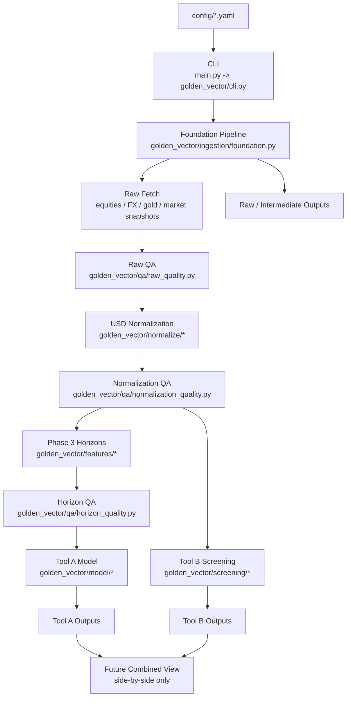

# Golden Vector Architecture Map

This is the shortest useful mental model of the codebase.

## Product Shape

Golden Vector is one shared data backbone feeding two active engines:

1. Tool A: Golden Vector
2. Tool B: Screening
3. Future Combined View

The rule is simple:
- Tool A must work on its own
- Tool B must work on its own
- Combined is a later compare view, not an active backend engine

## End-to-End Flow

## Folder Mind Map

| Area | What it is | Main files |
|---|---|---|
| `main.py` | Thin entrypoint | [main.py](C:/Users/Emanuel/code/Golden-Vector/main.py) |
| `golden_vector/cli.py` | Main command orchestrator | [cli.py](C:/Users/Emanuel/code/Golden-Vector/golden_vector/cli.py) |
| `golden_vector/app/` | Paths, config loading, run metadata, logging | [app](C:/Users/Emanuel/code/Golden-Vector/golden_vector/app) |
| `config/` | Business rules and frozen settings | [config](C:/Users/Emanuel/code/Golden-Vector/config) |
| `golden_vector/contracts/` | Typed config and dataset shapes | [contracts](C:/Users/Emanuel/code/Golden-Vector/golden_vector/contracts) |
| `golden_vector/ingestion/` | Yahoo fetch + standardization + persistence | [ingestion](C:/Users/Emanuel/code/Golden-Vector/golden_vector/ingestion) |
| `golden_vector/qa/` | Data-quality gates | [qa](C:/Users/Emanuel/code/Golden-Vector/golden_vector/qa) |
| `golden_vector/normalize/` | USD conversion layer | [normalize](C:/Users/Emanuel/code/Golden-Vector/golden_vector/normalize) |
| `golden_vector/features/` | Horizon parsing and return engine | [features](C:/Users/Emanuel/code/Golden-Vector/golden_vector/features) |
| `golden_vector/model/` | Tool A metrics, labels, scoring, ranking | [model](C:/Users/Emanuel/code/Golden-Vector/golden_vector/model) |
| `golden_vector/screening/` | Tool B manual-data store, valuation, ranking | [screening](C:/Users/Emanuel/code/Golden-Vector/golden_vector/screening) |
| `golden_vector/combined/` | Legacy archived backend code, not active runtime | [combined](C:/Users/Emanuel/code/Golden-Vector/golden_vector/combined) |
| `golden_vector/serve/` | Thin local presentation layer for the workspace UI | [serve](C:/Users/Emanuel/code/Golden-Vector/golden_vector/serve) |
| `data/manual/` | Local Tool B manual-data store plus optional CSV import/export support | [data/manual](C:/Users/Emanuel/code/Golden-Vector/data/manual) |
| `tests/` | Unit + integration safety net | [tests](C:/Users/Emanuel/code/Golden-Vector/tests) |

## Command Map

| Command | What it does | Main path |
|---|---|---|
| `python main.py update-data` | Refreshes Yahoo-backed market data and publishes the latest validated local snapshot | [foundation.py](C:/Users/Emanuel/code/Golden-Vector/golden_vector/ingestion/foundation.py), [latest_data.py](C:/Users/Emanuel/code/Golden-Vector/golden_vector/app/latest_data.py) |
| `python main.py tool-a` | Uses the latest validated local snapshot, builds the official weekly structural Tool A sample, then scores and explains the latest names | [features/pipeline.py](C:/Users/Emanuel/code/Golden-Vector/golden_vector/features/pipeline.py), [model/pipeline.py](C:/Users/Emanuel/code/Golden-Vector/golden_vector/model/pipeline.py) |
| `python main.py tool-b --gold-price 4000` | Uses the latest validated local snapshot plus the local Tool B manual-data store, then runs screening | [screening/pipeline.py](C:/Users/Emanuel/code/Golden-Vector/golden_vector/screening/pipeline.py) |
| `python main.py manual-data ...` | Creates, imports, exports, shows, and updates slow-moving Tool B inputs directly in the local store | [manual_store.py](C:/Users/Emanuel/code/Golden-Vector/golden_vector/screening/manual_store.py), [manual_data.py](C:/Users/Emanuel/code/Golden-Vector/golden_vector/screening/manual_data.py) |
| `python main.py manual-note ...` | Adds and lists per-stock follow-up notes | [manual_store.py](C:/Users/Emanuel/code/Golden-Vector/golden_vector/screening/manual_store.py) |
| `python main.py workspace` | Starts the local browser workspace for Tool B inputs, notes, and latest Tool A / Tool B snapshots | [workspace.py](C:/Users/Emanuel/code/Golden-Vector/golden_vector/serve/workspace.py) |
| `python main.py compare-horizons --ticker NEM --horizons 5D,10D,45D,3M` | Exploratory Tool A horizon comparison | [features/horizons.py](C:/Users/Emanuel/code/Golden-Vector/golden_vector/features/horizons.py), [features/returns.py](C:/Users/Emanuel/code/Golden-Vector/golden_vector/features/returns.py) |

## What Is Built

| Layer | Status | Short explanation |
|---|---|---|
| Backbone | Built | Fetches and validates raw market data, then normalizes it to USD |
| Tool A | Built | Computes structural delta, gamma, asymmetry, confidence, and volatility diagnostics from weekly USD-normalized returns, then scores and explains names |
| Tool B | Built | Uses the local manual-data store plus market snapshots to screen and rank names |
| Combined backend | De-scoped | Old backend preserved as legacy code, but no longer part of the active product |
| Tests | Strong | 282+ passing tests covering core business rules, orchestration, the structural Tool A pipeline, the SQLite manual store, the workspace UI (three views + DataTables sort/filter + Screening Parameters overrides), Tool B scenario math, and provenance/alias safety |
| Serve / dashboard | Built | Local browser workspace at `/`, `/tool-a`, `/tool-b` with click-sort, per-column filter dropdowns, live search, per-ticker detail pages, and live scenario overrides (gold-price, thresholds, tier discounts) for Tool B |

## What Happens To Data

| Stage | Output type | Where it goes |
|---|---|---|
| Raw fetch | raw parquet + fetch status + raw QA | `data/raw/`, `data/runs/` |
| Normalization | USD-normalized parquet + normalization QA | `data/intermediate/`, `data/runs/` |
| Tool A | full-history + latest snapshot parquet/csv plus structural window metrics | `data/output/tool_a/` |
| Tool B | full-history + latest snapshot parquet/csv | `data/output/tool_b/` |
| Workspace | local browser view over latest Tool A / Tool B snapshots plus Tool B manual store | `golden_vector/serve/workspace.py` |
| Future Combined view | later side-by-side output only | not active yet |

## Hard Rules In Code

- No mixed-currency analytics before normalization
- No official scoring from custom horizons
- No scoring before QA gates pass
- No hidden manual overrides
- Missing data should stay visible, not disappear silently

You can see these rules enforced mainly in:
- [raw_quality.py](C:/Users/Emanuel/code/Golden-Vector/golden_vector/qa/raw_quality.py)
- [normalization_quality.py](C:/Users/Emanuel/code/Golden-Vector/golden_vector/qa/normalization_quality.py)
- [horizon_quality.py](C:/Users/Emanuel/code/Golden-Vector/golden_vector/qa/horizon_quality.py)
- [labels.py](C:/Users/Emanuel/code/Golden-Vector/golden_vector/model/labels.py)
- [screening/pipeline.py](C:/Users/Emanuel/code/Golden-Vector/golden_vector/screening/pipeline.py)
- [golden_vector/combined/README_LEGACY.md](C:/Users/Emanuel/code/Golden-Vector/golden_vector/combined/README_LEGACY.md)

## What Is Next

1. Explicit refresh plus local-first usage
   Keep `update-data` as the heavy refresh step and keep Tool A / Tool B local by default.

2. Tool A threshold tuning
   Tune the new structural-first bands and interaction explanations against live names.

3. Tool B hardening
   Add more warnings around real market-data weirdness, especially snapshot consistency and sanity checks.

4. Manual Tool B workflow polish
   Keep evolving the new local app data store and workspace so direct editing and notes become the normal Tool B workflow.

5. Future Combined compare view
   Build a lightweight side-by-side view later, not a third backend engine.

## Fastest Reading Order

If you want to understand the code quickly, read in this order:

1. [main.py](C:/Users/Emanuel/code/Golden-Vector/main.py)
2. [cli.py](C:/Users/Emanuel/code/Golden-Vector/golden_vector/cli.py)
3. [foundation.py](C:/Users/Emanuel/code/Golden-Vector/golden_vector/ingestion/foundation.py)
4. [features/pipeline.py](C:/Users/Emanuel/code/Golden-Vector/golden_vector/features/pipeline.py)
5. [model/pipeline.py](C:/Users/Emanuel/code/Golden-Vector/golden_vector/model/pipeline.py)
6. [screening/pipeline.py](C:/Users/Emanuel/code/Golden-Vector/golden_vector/screening/pipeline.py)
7. [golden_vector/combined/README_LEGACY.md](C:/Users/Emanuel/code/Golden-Vector/golden_vector/combined/README_LEGACY.md)
