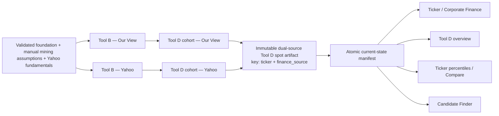

# Golden Vector professional platform redesign

> **SUPERSEDED 2026-08-12.** Claude Code took ownership of this proposal per Victor's instruction,
> verified every code claim against `f45560a`, and issued the final implementation plan:
> `reviews/codex/claude_platform_redesign_plan_final_2026-08-12.md`. That file is the authority;
> this one remains unchanged below as audit history. Key corrections are logged in its §1
> decision table (D1–D17).

## Full implementation plan for Claude Code review

- **Requested by:** Victor
- **Prepared by:** Codex
- **Date:** 2026-08-12
- **Repository base reviewed:** `f45560ae9e001e8c2fae667297879bb02f394e60`
- **Working branch at review time:** `dev-vic`
- **Status:** FULL SCOPE APPROVED BY VICTOR FOR CLAUDE CODE REVIEW — do not implement or merge until the review gate in §20 is complete
- **Product scope:** platform-wide visual system and interaction cleanup, with `/ticker/<T>` as the reference implementation
- **Correctness scope:** fractional gold-dial state, repeated basis dates, performance-chart units, ticker navigation identity, and dual-source Corporate Resilience
- **Reference mock:** `.playwright-mcp/mock3.html`
- **Reference artifact:** <https://claude.ai/code/artifact/1059868b-3d00-42ab-96ff-9a2cfbdd179a?via=auto_preview>

---

## 1. Executive decision

**Scope decision recorded 2026-08-12:** Victor approved the complete program in this document:
professional ticker polish, persisted dual-source Corporate Resilience, shared design-system
extensions, ticker reference implementation, related source-control consistency, platform-wide
visual rollout, and final hardening. Claude should review the plan for correctness and safety, not
reduce the approved scope merely because it is substantial. Material alternatives discovered during
review must be presented explicitly to Victor before implementation.

Golden Vector should move toward a dense, institutional research interface: information-first,
numerically precise, keyboard-friendly, restrained, and visibly trustworthy. “Bloomberg feeling”
means the professional qualities of a terminal—not copying Bloomberg branding or reproducing its
interface literally.

The work will be delivered in separable milestones:

1. Correct the misleading states already visible on the ticker page.
2. Make Corporate Resilience truthful and available for both financial sources;
3. extend the existing Golden Vector design system with compact analytical components;
4. use the ticker page as the complete reference implementation;
5. roll those shared components across the rest of the workspace;
6. run a full data, browser, accessibility, performance, and integration release gate.

The redesign is not permission to remove later features merely because the mock predates them.
Currency Attribution, the five market-behaviour windows, cost/downside evidence, volatility,
provenance, input management, option safeguards, and accessible chart tables all remain.

---

## 2. Authority, preservation, and supersession

### 2.1 Authority order

When two documents disagree, use this order:

1. Victor's latest explicit decisions in this plan.
2. `AGENTS.md`, `CLAUDE.md`, and `ARCHITECTURE_FOUNDATIONS.md`.
3. `reviews/codex/claude_ticker_page_requirements.md`, except for the explicit deltas in §2.3.
4. Current contracts, code, and tests at the reviewed repository base.
5. Historical plans, reviews, screenshots, and mockups as evidence—not authority over live contracts.

### 2.2 Supersession statement

This plan supersedes the presentation direction and execution instructions in the 2026-08-10
visual-redesign plan, plus the ticker plan's Yahoo-resilience deferral. It preserves the locked
ticker-page order, analytical meaning, runtime rules, Currency Attribution, source semantics,
progressive disclosure, conditional Options behavior, accessibility, and current UI architecture
except where the decision-delta table below says otherwise.

Old files remain unchanged as audit history.

### 2.3 Explicit decision deltas

| Earlier decision | New decision | Reason |
|---|---|---|
| Ticker redesign was scoped to `/ticker/<T>` only. | The ticker page remains the pilot, but the visual system rolls out platform-wide. | Victor asked to improve the platform, and the current spacing, control, table, and panel rules are shared. |
| Headline cards should show spot and scenario values together once the dial moves. | Headline cards show **one active value**. Spot-versus-scenario stays in expanded audit tables. | Two stacked values looked duplicated and reduced trust. Both values remain available for auditability. |
| Corporate Resilience was deliberately disabled in Yahoo mode. | Healthy Yahoo mode receives its own persisted Tool D result and source-specific percentile. | Resilience should work under both financial sources without relabelling Our View data. |
| “Jump to ticker” was deferred. | Activate a configured-universe ticker jump in the company command bar. | It is a high-value feature visible in the approved mock and improves terminal-like navigation. |
| Currency handling was deferred in the original requirements. | Preserve the shipped Currency Attribution block and integrate it visually. | It is a later approved addition and solves a real non-USD interpretation problem. |
| The old mock displayed Free Cash Flow and FCF yield. | Do not restore removed FCF names as a styling task. Use the current trusted AISC-margin terminology and published fields. | `tests/test_screening_layer1.py` explicitly bans the removed FCF vocabulary. Reintroducing it requires a separate analytics decision and validated contract. |
| Historical source-mode planning allowed request-time recomputation. | Ticker and Tool D resilience read persisted dual-source artifacts. | Current architecture requires compute once, persist, and serve reads. |

### 2.4 Locked behavior that remains

- Ticker primary-section order remains Performance → Corporate Finance → Market Behaviour →
  Options → Compare → Your Inputs and Notes. Currency Attribution is a conditional subsection of
  Performance and is not a separate primary navigation anchor.
- Options remains completely absent when a current artifact proves the company has no listed options.
- No compiled/blended Golden Vector score is restored to the ticker page.
- Failing screening checks remain at-spot statements and appear only when something fails.
- “Target window” remains the option-contract control name; do not revert to the mock's old expiry
  selector wording.
- Gold scenario evaluation remains the sanctioned backend-lines plus narrow browser-evaluation
  design. Do not move financial modeling into request handlers.
- Every chart retains an accessible data-table equivalent.
- Source, basis, dates, missingness, and degraded states remain truthful and inspectable.
- No mixed currencies without explicit normalization and labeling.

---

## 3. Evidence: what is wrong today

### 3.1 Gold-dial false scenario state

The backend is not sending duplicate financial data. It renders one persisted spot value and one
hidden scenario slot in `golden_vector/serve/ticker_page/corporate.py::_headline_cards()`.

The actual failure chain is:

1. True spot is `$4,477.40`.
2. The HTML range has a `$1` step but receives `value="4477.4"`.
3. The browser normalizes the range value to a legal whole-dollar position.
4. `golden_vector/serve/static/gold-dial.js` compares that normalized value with the exact persisted
   spot using a near-zero epsilon.
5. JavaScript falsely concludes that the user moved the dial and unhides the scenario slots.
6. The `$0.40` change rounds to the same formatted KPIs, so the page appears to repeat every number.
7. Reset writes the fractional value back into the whole-dollar range and repeats the same defect.

This is a state-machine bug, not an analytics duplication bug.

### 3.2 Dates and basis text repeat seven times

`render_corporate_finance_section()` prints the spot/date basis in the section introduction, then
`_headline_cards()` repeats the same full sentence under every one of six cards. Provenance is
important; repeating identical provenance is noise. The target is one visible section basis strip
plus complete details in “Data quality and sources.”

### 3.3 Performance controls exist in query state but are not rendered

The request path already resolves chart horizon and view, but
`ticker_page/sections.py::render_performance_section()` renders no visible Compare/Share Price or
1Y/3Y/5Y controls. The mock therefore feels interactive while the live page feels like a static
report.

### 3.4 The Share Price view uses a rebased-only formatter; the rebased view itself is valid

`serve/charts.py::_build_multiline_overlay_svg()` assumes indexed-to-100 percentage semantics.
`render_performance_section()` also passes stock prices to it for Share Price view. That creates
incorrect axes, tooltips, caption language, and accessible-table formatting **in Share Price mode**.

The persisted rebased series is not the bug. Its producer deliberately puts Stock, Gold, GDX, and
GDXJ on one common calendar and one common anchor where every included series equals 100. That is
the correct way to compare percentage performance across assets with different price levels.

Keep both views. Fix the shared renderer by giving it an explicit display mode—not by deleting the
rebased chart or cloning the chart primitive.

### 3.5 Yahoo resilience is supported by the model but disabled downstream

`model/tool_d.py` already accepts `finance_source`, passes it through Tool B calculations, and
prevents Yahoo debt/interest from silently borrowing Our View values. The feature is disabled later:

- `cli.py::run_tool_d()` computes only the default Our View output;
- `model/ticker_page.py::build_score_percentiles()` intentionally empties Tool D records in Yahoo mode;
- `ticker_page/corporate.py::_resilience_group()` intentionally displays a disabled message;
- detail and persistence readers identify Tool D rows only by ticker.

### 3.6 Current visual hierarchy is too consumer-like and too loose

- Global buttons and section links are mostly large pills.
- Panels use generous spacing and 14px radii.
- The main content canvas is capped at 1240px despite data-dense tables and charts.
- Corporate KPI cards have no card surface, border, or padding; they read as loose text columns.
- Important and secondary information use similar scale and contrast.
- Numeric alignment is inconsistent.
- Repeated captions and explanatory sentences dominate the data.
- `.button-like` is emitted by several controls but has no canonical stylesheet definition.
- The standard ticker page incorrectly marks Candidate Finder as the active primary navigation item.

---

## 4. Mock-to-live gap inventory

This is the working inventory Claude must verify against current HEAD before implementation.

### 4.1 Build or improve

| Area | Mock advantage / live gap | Planned result |
|---|---|---|
| Company identity | Mock combines ticker, company, currency, jurisdiction, and quote. Live header is mostly the ticker. | Compact company command bar backed only by configured/persisted data. |
| Ticker navigation | Mock has Jump to ticker. Live page requires returning to another page. | Configured-universe jump field with keyboard submission. |
| Source selection | Mock uses a clear segmented control. Live source links feel secondary and inconsistent. | One shared `Our View` / `Yahoo Fundamentals` segmented control. |
| Gold scenario | Mock keeps the dial compact and visually connected to the source. Live control occupies a loose panel and falsely activates. | Compact control with explicit untouched/scenario/reset states. |
| Performance mode | Mock exposes two useful charts: Compare (rebased) and normal Share Price. Live page supports both states but hides the controls and formats Share Price through a rebased-only renderer. | Preserve both as first-class views, show the segmented control, and give each view correct units. |
| Performance horizon | Mock exposes 1Y/3Y/5Y. Live page hides it. | Visible horizon control independent of beta window. |
| Series visibility | Mock lets users focus on stock/gold/GDX/GDXJ. | Accessible legend checkboxes that only change visibility, never data. |
| Chart finish | Mock has stronger grid, legend, endpoints, and hierarchy. | Thin grids, correct units, compact legend, consistent dash patterns, readable endpoints. |
| Corporate hierarchy | Mock gives Corporate Finance a clear narrative and basis. | Section heading, one basis strip, dense KPI row, one fail notice, details below. |
| KPI cards | Mock has framed, aligned tiles. Live KPIs are unframed text columns. | Shared dense data-card shell with tabular numbers. |
| Scenario display | Mock labels state clearly. Live page can stack indistinguishable values. | One headline value; comparison only in expanded tables. |
| Screening alert | Mock summarizes failed checks in one restrained bar. | Preserve the truthful at-spot sentence builder and improve visual hierarchy. |
| Section navigation | Mock reads like a research workstation. Live page uses oversized pill anchors. | Compact rectangular section tabs/links with the same accessible anchors. |
| Tables | Mock is compact and aligned. Some live tables are visually heavy. | Sticky headers, right-aligned numerics, thin separators, restrained hover/focus. |
| Inputs | Mock keeps maintenance secondary. Live page renders four large open panels. | One closed “Your inputs and notes” workspace containing the four existing forms. |
| Density | Mock fits more decision-useful data above the fold. | Desktop density modifier; deliberate tablet/mobile collapse. |
| Navigation identity | Mock's page context is explicit. Live ticker page says Candidate Finder is current. | Neutral Company Profile context unless the Option Trading lens is genuinely active. |
| Empty/degraded states | Mock is visually coherent but static. Live states vary by renderer. | Shared compact status/empty-state treatment with exact reasons. |
| Numeric typography | Mock feels terminal-like because numbers align. | Data font and `font-variant-numeric: tabular-nums` for KPIs and numeric cells. |
| Brand use | Mock uses gold as selective focus. Live controls can make gold feel decorative. | Gold reserved for active source/scenario/primary emphasis; semantic states retain semantic colors. |

### 4.2 Preserve and integrate—the mock predates these improvements

| Later feature | Required treatment |
|---|---|
| Currency Attribution | Keep it after Performance. Hide/compact it for USD listings as today; make non-USD basis obvious. |
| Five market-behaviour windows | Keep the centralized window configuration and existing evidence. Restyle only. |
| Cost/downside evidence | Keep all trusted metrics and explanations. Move detail behind existing disclosure rules where appropriate. |
| Volatility panels | Keep measured volatility; apply shared data-card/chart presentation. |
| Provenance and source verification | Keep complete details; consolidate repeated summaries. |
| Company inputs, calendar, verification, and notes | Keep all form behavior, errors, echoes, redirect/query state, and persistence. Consolidate presentation only. |
| Option safeguards | Keep stale quote rules, availability truth, liquidity gates, target windows, Greeks, and sizing protections. |
| Accessible chart tables | Preserve for every chart even when the visual chart receives new controls. |
| Compare builder | Keep opt-in scoring, precomputed percentiles, source state, contribution view, and stability warning. Improve density only. |

### 4.3 Do not copy from the mock

- `MOCK v3` banner and “Show design notes.”
- Frozen example values, dates, or ranks.
- Any value not backed by the current manifest-resolved artifacts.
- Old expiry-selector language; retain `Target window`.
- Removed FCF/FCF-yield naming or any unsupported mock KPI.
- Mock-only typos or percentile wording.
- Static controls that look interactive but have no truthful live behavior.
- A literal Bloomberg copy, logo treatment, or proprietary visual imitation.

---

## 5. Product outcomes and measurable success

### 5.1 User outcomes

After opening a company page, a user should be able to answer quickly:

- What company and listing am I looking at?
- Which financial source is active?
- What is the market and gold-price basis?
- How has the share performed versus gold and miner ETFs?
- What do the main economics and valuation metrics say at spot?
- What changes if I move gold?
- Where does the company break under stress?
- What data is missing, stale, mixed, or unavailable?
- Where can I inspect the full evidence or edit my inputs?

### 5.2 Acceptance signals

- Initial Corporate Finance shows exactly one visible headline value per KPI.
- A fractional spot such as `$4,477.40` never activates scenario state on load.
- The same source/date/basis sentence is not repeated under each card.
- Both healthy financial sources show their own resilience values.
- No Yahoo screen contains silently substituted Our View resilience values.
- Compare and Share Price use correct and visibly different units.
- The active financial source, chart mode, and horizon are obvious without reading the URL.
- At 1440px, the primary identity, controls, chart, and first Corporate Finance context feel like one
  coherent research surface rather than stacked forms.
- The page works at 390px without page-level horizontal scrolling.
- Keyboard and screen-reader behavior remains complete.
- No analytics or data fetching is added to a request handler.

---

## 6. Target ticker-page information architecture

The section order stays locked. Only hierarchy and control placement change.

### 6.1 Top region

1. Back link, visually quiet.
2. Company command bar.
3. Compact section navigation.

### 6.2 Main content

1. Performance
2. Corporate Finance
3. Market Behaviour
4. Options when available
5. Compare on Your Own Terms
6. Your Inputs and Notes, closed by default

Currency Attribution remains a conditional subsection inside the Performance region, between its
chart and Corporate Finance in document flow, and is excluded from primary section navigation.

### 6.3 Company command bar

Desktop layout:

```text
NEM  Newmont  · USD · Tier 2 jurisdiction     Jump to ticker
Share $116.14 · market date                   Gold scenario [slider] $4,477  Reset
Financials source [Our View] [Yahoo Fundamentals]
```

The exact wrapping can vary by width, but the semantic groups remain.

Responsive command-bar contract:

| Width | Layout and reading order |
|---|---|
| ≥1280px | Two compact rows: identity + jump; quote/basis + scenario + source. Slider receives the flexible middle track. |
| 768–1279px | Three-row grid: identity; quote/source; jump/scenario. Long company text wraps, never overlays a control. |
| 320–767px | One semantic column: identity → quote/basis → jump → source → scenario/reset. The slider is full width. |

At 1024, 768, 390, and 320px, no command-bar label is ellipsized when it is the only source of
meaning. The section navigation uses the existing tested wrapping strategy and becomes non-sticky at
the current narrow breakpoint; it does not become an anonymous horizontal scroller.

Required behavior:

- Company name, currency, jurisdiction, and configured identity come from `config/universe.yaml`.
- Share price and market date come from the resolved current snapshot—not a browser fetch.
- Missing identity fields are omitted; no guessed placeholder prose.
- Jump to ticker uses only active configured tickers, normalizes with the existing ticker helper,
  and performs a normal GET to `/ticker/<T>`.
- Enter submits; suggestions are keyboard accessible; an invalid ticker follows the existing honest
  unknown-ticker behavior.
- The selected financial source survives a ticker jump.
- The gold scenario does not survive navigation or a source switch; it is temporary scratch state.
- The command bar is not a second sticky layer in the first release. This avoids colliding with the
  existing sticky app header and section navigation.

---

## 7. Exact user-visible behavior contracts

### 7.1 Financial-source control

Use the exact labels:

```text
Financials source   [Our View] [Yahoo Fundamentals]
```

Contract:

- Default is `Our View`.
- Unknown values normalize to `Our View` through the existing source parser.
- Exactly one source is visibly and semantically selected.
- Links preserve unrelated query state: chart horizon/mode, market-behaviour window, compare state,
  options target window, and lens. Source changes deliberately return to the top command bar; the
  server cannot recover an arbitrary browser fragment because fragments are not sent in requests.
- Switching source resets the temporary gold scenario to that source's spot state.
- Switching source updates these as one server-rendered state:
  - Corporate Finance headline and detail values;
  - financial checks and fail notice;
  - gold-response payload;
  - Corporate Resilience;
  - finance/resilience metrics in Compare.
- Performance, Currency Attribution, and Market Behaviour do not change merely because statement
  source changes.
- Missing active-source values remain missing. Never promote the alternate source into the primary
  value.

### 7.2 Corporate Finance basis strip

First-release target examples:

```text
Our View · spot gold $4,477.40/oz as of 12 Aug 2026
Yahoo Fundamentals · spot gold $4,477.40/oz as of 12 Aug 2026
```

Rules:

- Show each shared date once in the open Corporate Finance region.
- Do not use Tool B's model/run `as_of_date` as if it were a financial-statement period.
- Omit a financial-statement date from the open strip in this release. Yahoo field-level
  `period_end` values and Our View verification dates may differ, and no authoritative shared period
  currently exists.
- Use compact human-readable dates in the UI; persisted values remain unchanged.
- A hypothetical scenario price has no “as of” date.
- A stale, missing, or misaligned family gets one compact visible status and a plain reason.
- Full provenance remains in “Data quality and sources”:
  - financial source and field-level statement period(s)/verification dates;
  - market snapshot date;
  - gold price and source date;
  - FX date/status when relevant;
  - refresh/run identity;
  - data-quality status and exact reasons.

### 7.3 Gold-dial state machine

#### State A — unavailable

- Spot KPIs remain readable when trustworthy.
- The slider is disabled.
- A short reason appears once: missing spot, spot outside configured range, missing source-specific
  response pack, or degraded/nonlinear response.
- No opposite-source fallback.
- No scenario slots become visible.
- The disabled range carries `aria-describedby` pointing to the visible reason and truthful
  `aria-valuetext`, such as `Scenario unavailable — spot gold is outside the configured range`.

#### State B — untouched spot

- Capture the browser-normalized initial slider position as the UI clean-state baseline.
- Keep exact persisted spot separately for calculations, display, and provenance.
- Show one spot value per headline card.
- Show `Spot gold $4,477.40/oz` in the control/basis context.
- Keep Reset rendered but natively disabled for a stable layout.
- A disabled Reset is skipped in normal keyboard tab order; it becomes reachable when a genuine
  scenario enables it.
- Set `data-scenario-active="0"`.
- Do not announce “Back at spot” during page load.
- Set the range's `aria-valuetext` to the exact semantic state, for example
  `$4,477.40 per ounce, spot`, even though the native whole-dollar slider position is `$4,477`.

#### State C — active scenario

- Enter only after a genuine user interaction moves away from the normalized starting position.
- Show `Scenario $4,200/oz · baseline spot $4,477.40/oz`.
- Enable Reset.
- Headline cards replace their spot headline with one scenario headline value.
- Expanded moving tables show both clearly labelled Spot and Scenario columns.
- Update the live region after the existing debounce:
  `Scenario $4,200 per ounce. Corporate finance values updated.`
- Update `aria-valuetext`, for example
  `$4,200 per ounce, scenario; spot $4,477.40 per ounce`.
- Persist nothing and add nothing to the URL.

#### State D — returned/reset

- Returning the slider manually to its initial normalized position clears scenario state.
- Reset returns to the same untouched UI state even when exact spot contains cents.
- Reset assigns the saved browser-normalized starting position to the native range; it never writes
  the fractional persisted spot back into an incompatible whole-dollar step control.
- Restore spot card values, hide scenario-only columns, and disable Reset.
- Announce only after a user action:
  `Reset to spot $4,477.40 per ounce.`
- Restore spot `aria-valuetext` after manual return and Reset.

#### Edge conditions

- If exact spot is outside the configured range, do not silently clamp it; disable the scenario
  control and state why.
- If spot is missing/non-finite, do not render a misleading default.
- A very small real movement can produce a rounded KPI identical to spot; the headline still shows
  only one value and the state label remains explicit.
- Invalid ratio results show exact guards such as `Not meaningful — EBITDA ≤ 0`, never zero, blank,
  or infinity.
- With JavaScript disabled, persisted spot values and provenance remain readable and scenario-only
  UI is unavailable honestly.

### 7.4 Corporate Finance headline metrics

Milestone 1 retains the current six-card set because those metrics have persisted display-ready spot
values and therefore work without JavaScript:

1. Cash margin / oz
2. Margin %
3. AISC margin yield
4. EV / EBITDA (forward)
5. Forward P/E
6. Stressed forward leverage

The longer-term recommended open set is:

1. Revenue
2. Forward EBITDA
3. Cash margin / oz
4. Margin %
5. AISC margin yield
6. EV / EBITDA (forward)
7. Forward P/E
8. Stressed forward leverage

Revenue and Forward EBITDA currently have line coefficients but no persisted display-ready spot
columns. They may be promoted only through a separately reviewed, versioned gold-response schema
change adding exact server-renderable spot values for both sources, with artifact/model-state/no-JS
tests. Do not derive those spot headlines in serve code. Until then, retain the current six cards.

Card contract:

- one framed compact card per metric;
- one primary value;
- tabular/monospaced numeric typography;
- metric help from the existing shared help registry;
- compact `SPOT` or `SCENARIO` state only where the surrounding basis is insufficient;
- no repeated dates;
- no unlabeled second value;
- missing/invalid values show a reason;
- fixed facts remain in their appropriate expanded table.

### 7.5 Yahoo Corporate Resilience

Healthy Yahoo mode must render resilience. Its truthful basis is:

```text
Yahoo financials · Our View mining assumptions
```

This is not mixed-source deception: statement-derived debt, interest, and finance fields are Yahoo;
manual mining assumptions such as AISC, production, and reserve life remain explicitly Our View.

Contract:

- Both sources have independent persisted Tool D rows keyed by `(ticker, finance_source)`.
- Yahoo uses Yahoo source-switchable finance inputs.
- Missing Yahoo debt/interest never falls back to Our View.
- Data incompleteness produces source-specific degraded rows and exact metric reasons.
- Unexpected compute/schema/publish failure aborts the new generation and leaves the previous
  coherent current state active.
- A missing Yahoo row never reveals Our View resilience numbers.
- Rankings and percentiles are calculated within separate source cohorts.
- The Tool D overview, ticker page, Candidate Finder, and ticker Compare use the same source key.
- Portfolio remains explicitly Our View in this project; source-aware portfolio resilience is a
  separate product decision.

### 7.6 Performance

Visible controls:

- View: `Compare` / `Share price`.
- Horizon: `1Y` / `3Y` / `5Y`.
- Series in Compare: Stock, Gold, GDX, GDXJ.

Rules:

- Initial state remains Compare + 1Y.
- Both views are required. `Share price` supplements `Compare (rebased)`; it never replaces it.
- Horizon is independent of market-behaviour/beta window.
- `Compare (rebased)` draws Stock, Gold, GDX, and GDXJ. It uses the already-persisted common-anchor
  series: every included line equals 100 on the same rebase date, and the axis/tooltips/table express
  change from that shared start in percentage terms.
- The rebased producer semantics remain unchanged unless a failing data-contract test proves a
  separate defect. This redesign does not reinterpret, independently rebase, or recompute the lines.
- `Share price` draws the subject stock alone at its persisted USD-normalized price level selected by
  `price_basis` (adjusted where available; the close-price fallback remains disclosed). For NEM that
  is a normal dollar-price chart like the mock. Its axis,
  tooltips, caption, ARIA label, and accessible table use price/currency units—not percentage-change
  or “indexed to 100” language.
- If a future artifact carries a currency other than USD, formatting follows its explicit
  `currency_basis`; never infer a symbol from the ticker.
- Generalize `_build_multiline_overlay_svg()` with an explicit value/display mode and formatter.
  Do not introduce a second overlay builder.
- Legend toggles may hide/show already-rendered series only. They perform no analytics, never fetch,
  and never change the accessible source data.
- Implement series visibility as progressive enhancement in a dedicated presentation-only module
  (prefer extending a chart-interaction module if one already owns the overlay; otherwise add one
  small `performance-series.js`). Server HTML renders all Compare series by default. JavaScript then
  reveals labelled native checkboxes with `aria-controls`; Share Price mode hides those controls.
  The complete accessible table is never filtered by visual visibility.
- The accessible table reflects the chart's units and labels correctly.
- Missing/late/stale benchmark rules and visible reasons remain unchanged.

The ticker page uses an opt-in wide canvas token validated at 1280px, 1440px, and at least one
ultrawide viewport. Choose the smallest measured maximum width that keeps the four-series chart and
eight-or-six-card grid legible (expected review range 1440–1600px); do not hard-code a width before
the baseline screenshots establish the need. Other routes retain their existing width until they
migrate.

### 7.7 Inputs and notes

Render one closed top-level disclosure: `Your inputs and notes`.

Inside it, preserve the four existing functions and form contracts:

- Company Inputs
- Reporting Calendar
- Source Verification
- Stock Notes

Rules:

- Validation errors reopen the relevant subsection and preserve submitted values.
- The parent disclosure owns the existing `id="inputs"`; child `reporting`, `verification`, and
  `notes` IDs remain unique and linkable.
- Existing redirect/anchor targets map to the appropriate child subsection. A validation failure
  opens the parent and relevant child, then moves focus to the error summary.
- Existing field names, endpoints, redirects, `return_to`, flash/error handling, and query state stay
  compatible.
- Consolidation is presentation-only; no persistence schema change.

---

## 8. Visual system specification

### 8.1 Design language

- Dark, neutral analytical canvas.
- High information density on desktop without small unreadable type.
- Borders and alignment carry hierarchy; shadows are minimal.
- Rectangular/segmented controls, not consumer-style pill collections.
- Gold is selective: active product state, scenario emphasis, and primary action—not positive return.
- Green/red retain genuine favorable/adverse semantics only.
- Numbers align; labels recede; provenance stays available.
- Short sentences replace repeated micro-copy.

### 8.2 Extend the existing system

Do not add another stylesheet bundle or component library. Extend:

- `serve/static/css/tokens.css`
- `base.css`
- `shell.css`
- `components.css`
- `tables.css`
- `charts.css`
- `pages.css`
- `responsive.css`
- `serve/ui/components.py`
- the existing `_metric_card()` in `serve/format_helpers.py`

`static/workspace.css` remains the one import manifest.

CSS ownership is strict:

| File | Allowed additions |
|---|---|
| `tokens.css` | Raw colors, spacing/density variables, dimensions, radii, z-index, motion |
| `base.css` | True global foundations, typography, focus, forced-colors—not feature layout |
| `shell.css` | App frame, sidebar, header, drawer, page-context shell |
| `components.css` | Reusable command bar, segmented control, data card, basis strip, disclosure/control variants |
| `tables.css` | Table and labelled table-region behavior |
| `charts.css` | Semantic chart/legend/control presentation |
| `pages.css` | Ticker composition scoped beneath a ticker-page root, then other page-local modifiers |
| `responsive.css` | Breakpoint/coarse-pointer/reflow overrides only |

Milestones 3–4 may not add new broad raw-element selectors or broad descendants such as
`.terminal-density button`. Components receive explicit classes.

### 8.3 Tokens and density

Add semantic density tokens rather than scattering values:

- compact control height;
- desktop panel/card padding;
- compact and standard gaps;
- data-label and data-value sizes;
- command-bar wrapping gap;
- content max width;
- optional terminal-density surface radius.

Target ranges for Claude to validate visually:

| Element | Desktop target | Mobile/touch rule |
|---|---:|---|
| Base content type | 14–15px | At least 15–16px where forms need it |
| Data label | 11–12px uppercase/letter-spaced | Remain readable; no truncation-only meaning |
| KPI value | 18–22px data font | Collapse grid before shrinking below readability |
| Compact control | 30–34px visual height | Minimum 44px touch target |
| Surface radius | 4–8px | Same or slightly larger, never nested bubble stacks |
| Grid gap | 8–12px | 10–14px after column collapse |

Do not globally change raw `button` or `.panel` in the ticker pilot. Add explicit shared variants,
then migrate consumers and only later consider changing defaults.

### 8.4 Shared presentation primitives

Extend existing helpers; do not create parallel renderers.

| Primitive | Responsibility | Important constraint |
|---|---|---|
| `command_bar` | Pure shell for identity, navigation, source, and scenario groups | Receives already-resolved HTML/text; no data lookup in `serve/ui` |
| `segmented_control` | Reusable selected link group for source, chart view, horizon | Accessible group label and selected semantics; preserves caller-built URLs |
| `data_card` | Successor/extension of `_metric_card()` with label/value/state/help/basis slots | One shared implementation; compatibility wrapper for existing callers |
| `basis_strip` | One compact source/date/basis statement per data family | Caller resolves semantics; component only renders |
| `section_tabs` variant | Compact rectangular style for existing anchor navigation | Anchors remain anchors; no route confusion |
| `terminal-density` modifier | Opt-in tighter panel/table/control spacing | Pilot first; no global surprise |

Remove or replace undocumented `.button-like` use with a defined shared button/control class. Audit
all existing consumers before deleting the old class name. Keep a compatibility style while the
canonical control is introduced; migrate ticker consumers in Milestone 4, Tool B/D in Milestone 5,
and remove the legacy name only after a final zero-consumer/dead-selector audit.

For URL-backed source/view/horizon controls, use a labelled group of ordinary links, not ARIA tabs.
Exactly one active link carries `aria-current="true"` plus a non-color visual indicator. Native link
keyboard behavior remains intact.

### 8.5 Tables

- `.table-region` remains the only horizontal-scroll owner.
- Numeric columns use the data font, tabular numbers, and right alignment.
- Headers may be sticky only within the correctly labelled scroll region.
- Use thin row separators and restrained row hover/focus.
- No entire-page `overflow-x` workaround.
- Do not hide provenance columns without a labelled disclosure or column chooser where required.

### 8.6 Charts

- Retain semantic SVG classes and centralized paint tokens.
- Keep stock, gold, GDX, and GDXJ colors distinct; gold commodity may use brand gold.
- Make the subject stock line visually primary (solid and modestly heavier); gold and ETF
  benchmarks are secondary and use distinct dash patterns as a non-color distinction.
- Thin grid lines; explicit axis units; compact legend.
- Pointer detail must have keyboard/touch-equivalent access through the table or direct controls.
- No canvas-only inaccessible chart replacement.

### 8.7 Shell and navigation

- Fix ticker page identity by separating page context from primary-nav selection.
- Recommended backward-compatible shell extension:
  `page_id` and `header_label` separate from `active_nav`.
- Standard ticker profile uses `page_id="ticker_detail"` and no false primary `aria-current`.
- Option Trading lens may keep the genuine Option Trading current state.
- Consider reducing desktop sidebar width only after the ticker pilot and route matrix prove no label
  clipping.
- Increase the content canvas through a token/opt-in page modifier first; do not surprise every page
  with a global max-width change.

### 8.8 Responsive and accessibility rules

- Preserve skip link, landmarks, heading order, and `main` focus target.
- Keep visible `:focus-visible`, forced-colors support, and reduced-motion behavior.
- Use `aria-current` for URL/navigation state and real checkbox state for chart visibility.
- Do not use color alone for selected, positive, negative, missing, or degraded meaning.
- Maintain 44px mobile touch targets.
- Cards deliberately collapse 4/2/1 or equivalent; they do not shrink indefinitely.
- Section nav stops sticking at the current narrow breakpoint unless a tested replacement is better.
- Any new sticky geometry uses tokens; no duplicated hard-coded offsets.
- Meet WCAG 2.2 AA contrast for text/control states, at least 3:1 for focus indicators and meaningful
  chart strokes against adjacent colors, and retain non-color distinctions.
- Test 200% and 400% zoom, 320px reflow, and long labels/data reasons.
- Existing small help affordances receive at least a 44px coarse-pointer hit area without making the
  visual icon itself oversized.

---

## 9. Dual-source Corporate Resilience architecture

### 9.1 Target flow



Our View and Yahoo are computed independently so one source's eligibility, missingness, or ranks
cannot contaminate the other source cohort.

### 9.2 Contract changes

- Bump `TOOL_D_SCHEMA_VERSION` because authoritative row identity/cardinality changes, even though a
  `finance_source` column already exists.
- Authoritative latest/spot key becomes `(ticker, finance_source)`.
- `finance_source` accepts only the centralized canonical values `our` and `yahoo`.
- Require one explicit row per active Tool-D ticker/source in a healthy build. Missing input data is
  represented by a degraded status/reason row, not by silently omitting the key.
- Reject duplicate composite keys before publication.
- Preserve source-specific status, source dates, run identity, and resilience reasons.

Do not introduce another Tool D contract module if the current schema remains owned by
`model/tool_d.py`; reconcile ownership first and keep one authority.

### 9.3 Producer changes

In the Tool D refresh/build path:

1. Resolve the coherent upstream generation once.
2. Build Our View Tool D with `finance_source="our"`.
3. Build Yahoo Tool D with `finance_source="yahoo"`.
4. Let each `compute_tool_d_outputs()` call rank only its own completed source cohort.
5. Concatenate the finished, schema-identical frames.
6. Validate expected keys, schema, uniqueness, statuses, refresh identity, and source labels.
7. Publish the full immutable artifact and spot snapshot within the same atomic generation.
8. Update aliases only as convenience; publish the manifest pointer last.

No live market/fundamental fetch is authorized by this work. Tests use committed fixtures; a real
refresh uses the existing configured data flow.

### 9.4 Persistence changes

Generalize the existing shared `_latest_snapshot()` helper to accept explicit key columns while
preserving its current ticker-only default for Tool A/B/C callers. Do not add a Tool-D-only copy.

Required behavior:

- sort and retain the latest row per supplied composite key;
- validate requested key columns;
- preserve both `(NEM, our)` and `(NEM, yahoo)`;
- fail on duplicate composite keys at the same authoritative date/state;
- write immutable run-stamped outputs and convenience aliases atomically;
- record path, hash, row count, schema version, source run, and refresh identity;
- never advance the current pointer for a partial/failed generation.

### 9.5 Model-state changes

- `tool_d_spot` becomes a manifest-resolved dual-source artifact used by ticker/read surfaces.
- New post-migration complete generations require a coherent spot artifact.
- Old current generations remain readable in an honest degraded/rebuild-required state until a new
  refresh succeeds; do not reinterpret an old one-row-per-ticker artifact as dual source.
- Cache identity includes the manifest-resolved immutable path/hash/generation—not a mutable alias
  modification time alone.
- Pruning retains the current immutable generation and honors existing retention rules.

### 9.6 Reader changes

| Consumer | Target rule |
|---|---|
| Ticker detail | Select exactly `(ticker, selected finance_source)`; absent row gives source-specific reason. |
| Corporate Resilience group | Remove the Yahoo-disabled branch; render selected row and truthful mixed-basis label. |
| Ticker percentile producer | Index Tool D by composite source key; calculate source-isolated percentile cohorts. |
| Compare builder | Read selected-source resilience percentiles; never duplicate source-independent metrics accidentally. |
| `/tool-d` | Filter the persisted dual-source artifact before rendering, sorting, links, and ranks. |
| Candidate Finder | Use the selected persisted source for resilience-dependent logic; remove request-time recomputation where it duplicates the published path. |
| Portfolio | Continue consuming explicitly labelled Our View Tool D rows in this project. |

### 9.7 Failure semantics

- Missing Yahoo fields: persist a Yahoo row with non-OK status and exact reasons.
- Missing Yahoo row due to an invalid build: fail schema/publication; do not publish a half-keyed set.
- Unexpected exception in either source computation: abort the generation and retain previous current.
- Our View upstream failure: fail the required stage.
- Yahoo data-quality failure: generation may still be complete if explicit degraded rows satisfy the
  contract; it may not silently disappear.
- Hash/schema/alignment failure at read time: show degraded state and no numbers from another source.

### 9.8 Architecture readiness checkpoint

| Capability | Current readiness | Plan consequence |
|---|---|---|
| Fractional dial behavior | Data pack is sufficient; browser state handling is wrong. | Fix inside the already sanctioned `gold-dial.js` exception; no new analytics. |
| Six current headline KPIs | Persisted display-ready spot values exist. | Safe for no-JS rendering and visual redesign. |
| Revenue/Forward EBITDA headline KPIs | Scenario coefficients exist, but display-ready spot columns do not. | Do not promote without a separate versioned gold-response artifact change. |
| Open-strip financial statement date | No single truthful period is currently resolved. | Omit it; retain field-level periods/dates in provenance. |
| Yahoo resilience | Model accepts the source, but persistence/readers collapse or disable it. | Milestone 2 must repair the data spine before Yahoo UI is enabled. |
| Shared visual system | Tokens, shell, components, tables, charts, and guardrails already exist. | Extend the current system; no second component/CSS architecture. |
| Serve-time computation | Current ticker gold dial is a documented narrow exception; Tool D request-time paths are legacy debt. | Do not add more. Replace duplicated resilience recomputation with persisted reads where this project touches it. |

The dual-source feature is not done merely when a Yahoo card renders. It is done only when it is
computed once, persisted with a composite key, resolved through the coherent manifest, source
isolated, fail-loud, and implemented without a duplicate helper.

---

## 10. File and ownership map

Claude must re-verify this map against current HEAD before editing.

### 10.1 Correctness and ticker composition

- `golden_vector/serve/ticker_page/corporate.py`
  - dial markup/payload
  - headline cards
  - repeated basis text
  - resilience rendering
- `golden_vector/serve/static/gold-dial.js`
  - normalized clean-state baseline
  - genuine-interaction state
  - reset and announcements
- `golden_vector/serve/ticker_page/sections.py`
  - visible performance controls
  - chart display mode and basis
- `golden_vector/serve/charts.py`
  - one generalized overlay formatter/mode
- `golden_vector/serve/detail_page.py`
  - command bar, composition, source state, form disclosure, page identity
- `golden_vector/serve/detail_panels.py`
  - existing financial-source switcher to migrate, not duplicate
- `golden_vector/serve/detail_forms.py`
  - existing forms preserved and composed under one parent disclosure
- `golden_vector/serve/url_helpers.py`
  - existing query-state-preserving URL builder

### 10.2 Shared UI

- `golden_vector/serve/ui/components.py`
- `golden_vector/serve/ui/status.py`
- `golden_vector/serve/ui/shell.py`
- `golden_vector/serve/format_helpers.py`
- `golden_vector/serve/static/css/tokens.css`
- `base.css`, `shell.css`, `components.css`, `tables.css`, `charts.css`, `pages.css`, `responsive.css`
- presentation-only JavaScript only where interaction cannot be expressed with semantic HTML/CSS

### 10.3 Resilience data spine

- `golden_vector/model/tool_d.py`
- `golden_vector/cli.py`
- `golden_vector/ingestion/persist.py`
- `golden_vector/ingestion/persist_tool_d.py`
- `golden_vector/app/model_state.py`
- relevant `ProjectPaths` definitions and pruning rules
- `golden_vector/model/ticker_page.py`
- `golden_vector/serve/ticker_page/data.py`
- `golden_vector/serve/overview_tool_d.py`
- `golden_vector/serve/candidate_finder_data.py`
- `golden_vector/portfolio/analytics.py` for explicit Our View filtering only

### 10.4 Existing primitives to reuse

- `golden_vector.common.numeric.optional_float`
- `golden_vector.common.strings.normalize_ticker`
- `golden_vector.screening.pipeline.normalize_finance_source`
- `serve/url_helpers.py::build_page_url`
- `golden_vector.common.files.atomic_write_many` for caught-error group rollback, paired with the
  manifest pointer for crash consistency
- `golden_vector.common.parquet.write_parquet_atomic` / `write_parquet_into`
- `golden_vector.ingestion.persist_option_artifacts.publish_option_artifacts_and_history_atomically`
  as the existing grouped publication pattern to adapt rather than copy blindly
- `_latest_snapshot()` after safe generalization
- existing manifest resolution/alignment helpers
- `golden_vector.features.percentile_ranks.oriented_percentile`
- current `COLUMN_HELP` registry and help popover
- `ui.tables.table_region`
- current notice/status shells
- current overlay chart primitive
- `_metric_card()` via extension/compatibility, not a second renderer

---

## 11. Implementation milestones

Each milestone is independently reviewable and reversible. Do not mix the Tool D schema migration
into a broad CSS commit.

### Milestone 0 — review, baseline, and integration safety

**Goal:** freeze current behavior and establish a safe branch state before implementation.

Tasks:

1. Claude reviews this plan using §20 and returns `APPROVE` or `NEEDS CHANGES`.
2. Reconcile any plan changes in this document before code begins.
3. Record current route screenshots and behavior at 1440, 1024, and 390px.
4. Copy the current mock HTML, source screenshots, and annotated target image into a tracked
   milestone evidence directory so review does not depend on `.playwright-mcp` or an authenticated
   external artifact.
5. Record current HTML payload size and server render timing for NEM Our/Yahoo.
6. Inventory all local/remote unmerged branches and worktrees.
7. Compare touched files across branches, especially Tool D, ticker artifacts, model state, Candidate
   Finder, Option Trading, Portfolio, and schema code.
8. Record the current focused and full test baseline.

Gate:

- approved plan;
- no unexplained failing baseline tests;
- no overlapping unmerged data-spine change without an integration strategy;
- baseline evidence saved under a new milestone directory.

### Milestone 1 — ticker correctness before styling

**Goal:** remove misleading behavior without changing the data model.

Tasks:

1. Fix fractional spot initialization using the normalized slider starting position as UI baseline.
2. Track whether a genuine user interaction occurred; suppress boot announcements.
3. Make Reset and manual return restore untouched state.
4. Render one headline value; retain spot/scenario columns in expanded tables using existing markup
   and minimal scoped styling.
5. Generalize overlay chart formatting for indexed and currency modes.

Date consolidation, visible segmented performance controls, shared basis-strip markup, and shell page
identity move together in Milestones 3–4 so this milestone does not create temporary page-local
components that are immediately replaced.

Primary tests:

- `tests/test_ticker_page_corporate.py`
- `tests/test_ticker_page_sections.py`
- `tests/test_ticker_page_js_parity.py`
- `tests/test_rebased_overlay_panel.py`
- `tests/test_workspace_app.py`
- `tests/test_redesign_routes.py`
- new real-JS fractional-dial behavior test using existing test/runtime dependencies

Gate:

- no duplicate headline values at untouched spot;
- Reset works for `$4,477.40` with `$1` step;
- price chart uses currency units end to end;
- focused suite green.

### Milestone 2 — persisted dual-source resilience

**Goal:** make Corporate Resilience work truthfully for both sources across all consumers.

Tasks:

1. Define and version the composite-key Tool D contract.
2. Generalize `_latest_snapshot()` with explicit key columns.
3. Compute Our View and Yahoo in independent calls/cohorts during Tool D refresh.
4. Validate and concatenate dual-source rows.
5. Publish immutable full/spot artifacts and manifest metadata atomically.
6. Update model-state requirements, alignment, hashes, pruning, and migration behavior.
7. Update ticker, `/tool-d`, percentile builder, Compare, and Candidate Finder readers.
8. Add explicit Our View filter/label to Portfolio consumption.
9. Remove the downstream Yahoo-disabled constants/branches only after all readers are source-aware.
10. Eliminate any duplicate request-time Yahoo resilience computation replaced by the persisted path.

Primary tests:

- `tests/test_tool_d.py`
- `tests/test_persist_tool_d.py`
- `tests/test_cli_tool_d.py`
- `tests/test_model_state.py`
- `tests/test_ticker_page_stage.py`
- `tests/test_ticker_page_producers.py`
- `tests/test_ticker_page_corporate.py`
- `tests/test_ticker_page_compare.py`
- `tests/test_candidate_finder_data.py`
- `tests/test_workspace_app.py`
- relevant Portfolio analytics suites

Gate:

- both `(NEM, our)` and `(NEM, yahoo)` survive full/latest/spot persistence;
- deliberately different source fixtures produce different values;
- Yahoo never borrows missing Our View debt/interest;
- ranks/percentiles are source isolated;
- fault injection proves prior current remains active after interrupted publication;
- readers never duplicate tickers or cross-leak sources;
- focused suites and full suite green because contracts changed.

### Milestone 3 — shared professional UI primitives

**Goal:** create one reusable system before restyling individual sections.

Tasks:

1. Add reviewed density/content tokens.
2. Extend shared component helpers with command bar, segmented control, basis strip, and data-card
   capabilities.
3. Preserve `serve/ui` purity; semantic decisions stay in data-aware renderers.
4. Define canonical compact control classes and a temporary `.button-like` compatibility mapping;
   do not migrate non-ticker consumers yet.
5. Add terminal-density modifiers for panels, tables, and forms.
6. Add correct numeric typography/alignment utilities.
7. Extend shell API with independent page context and active-nav state.
8. Add component contract and dead-selector tests before consumers migrate.

Gate:

- no duplicate component implementation;
- no raw colors outside `tokens.css`;
- no arithmetic/data imports in `serve/ui`;
- old pages render unchanged unless they opt into the new variants;
- design-token, UI-component, shell, and route guardrails green.

### Milestone 4 — ticker-page reference implementation

**Goal:** make the company page the approved professional reference surface.

Tasks:

1. Build the company command bar with configured/persisted identity.
2. Add configured-universe Jump to ticker.
3. Move source selection and gold scenario into the command bar.
4. Apply visible performance controls and series visibility controls.
5. Apply dense chart panel and correct basis captions.
6. Apply one shared source/spot-date basis strip and data cards to Corporate Finance; remove repeated
   card dates and retain field-level financial dates in provenance.
7. Use the new shell page-context API so ticker detail has no false primary nav item.
8. Migrate ticker `.button-like` consumers to the canonical control.
9. Restyle the fail notice and disclosures without changing their semantics.
10. Apply compact tables and headings through Market Behaviour, Options, and Compare.
11. Consolidate the four maintenance forms under one closed parent disclosure with the ID/focus
    contract in §7.7.
12. Preserve Currency Attribution and all later additions.
13. Validate every degraded/missing/empty state, not only NEM happy path.

Gate:

- complete ticker acceptance matrix in §15;
- screenshots approved against mock intent at desktop/tablet/mobile;
- no page-level overflow;
- all source/scenario/query state works;
- no data or runtime regression.

### Milestone 5 — related source-aware controls

**Goal:** make repeated source state and financial controls consistent. Density, table, chart, and
shell migration for these pages remains Milestone 6.

Order:

1. Corporate Finance `/tool-b`
2. Corporate Resilience `/tool-d`
3. Candidate Finder
4. ticker Compare consumers already covered in Milestone 4

Tasks:

- use the same segmented source control and exact labels;
- use the same source-control and source-basis rules where finance state repeats;
- preserve each page's current calculations, filters, routes, and artifacts;
- remove duplicate source-control markup after migration;
- ensure links carry source state correctly;
- do not turn unrelated market/option signals into source-dependent values.

Gate:

- the same metric/source has the same name, unit, basis, and selected-state treatment everywhere;
- no request-time analytics introduced;
- page-specific focused suites green.

### Milestone 6 — platform-wide visual rollout

**Goal:** apply the validated system without a one-shot global CSS rewrite.

Recommended order:

1. Candidate Finder tables and controls
2. Tool A, Tool C, and Tool D analytical panels
3. Option Trading
4. Portfolio
5. Lab
6. Scorecard

For each page:

1. Inventory components and states.
2. Replace duplicate presentation with shared primitives.
3. Apply density modifier and numeric alignment.
4. Verify tables, forms, charts, empty/degraded states, and query state.
5. Run that page's tests and browser states.
6. Capture before/after evidence.

Only after all primary pages migrate should Claude propose changing global `.panel`, raw `button`,
sidebar width, or global content width defaults.

Candidate Finder and Tool D reappear here intentionally only for their remaining density, table,
chart, and shell treatment; their source controls were completed in Milestone 5 and are not rebuilt.

Gate:

- all primary routes use the shared visual grammar;
- no separate page-specific design system;
- no regressions in forms, tables, conditional sections, or mobile drawer;
- full route/browser matrix passes.

### Milestone 7 — hardening and release

Tasks:

1. Add ticker and Tool D suites to `tests/tools/run_focused_selection.py`.
2. Update the focused-selection inventory assertion in `tests/test_workspace_shell.py`.
3. Run static/design guardrails, focused suites, then full suite.
4. Run a real coherent local refresh and verify the current manifest generation.
5. Verify request paths perform reads/rendering only.
6. Compare HTML payload/render timings to Milestone 0; explain any material regression.
7. Execute browser/accessibility matrix and capture final screenshots.
8. Run the mandatory branch/worktree integration audit before merging.
9. Follow the repository's `dev-vic` → `main` merge workflow only after approval.

Gate:

- Definition of Done in §19 is fully satisfied.

---

## 12. Detailed test plan

### 12.1 Gold dial

| Test | Required proof |
|---|---|
| Fractional spot boot | `$4,477.40`, `step=1`: scenario hidden, one value/card, Reset inactive, no announcement |
| No-op input | Input/change event with unchanged normalized value remains untouched |
| Genuine movement | Scenario activates and every moving metric updates from the approved payload |
| Manual return | Moving back to the starting slider position clears scenario state |
| Reset | Restores exact displayed spot and untouched UI state |
| Keyboard | Arrow keys, Home/End where supported, and Reset work without a mouse |
| Both sources | Same state behavior with different Our/Yahoo payloads |
| Missing payload | Spot values remain; dial disables with reason |
| Outside range | No clamping or false scenario; explicit unavailable reason |
| Invalid ratio | Exact calculation guard renders instead of blank/zero/infinity |
| No JavaScript | Server-rendered spot values and provenance remain intelligible |
| Source transition | Active scenario → source switch opens the new source untouched at its own spot, with one value/card, Reset disabled, no stale scenario text, and no boot announcement |
| Slider semantics | `aria-valuetext` reports exact spot/scenario semantics through boot, movement, manual return, Reset, unavailable state, and both sources |

The test must execute the real `gold-dial.js` state machine. A Python mirror or string scan alone is
not sufficient.

### 12.2 Dates and provenance

- one Corporate Finance basis strip in open content;
- no date-bearing basis element inside individual headline cards;
- common, mixed, missing, and field-level statement-period cases remain truthful in provenance and
  never relabel a run date as a statement date;
- scenario price has no fake as-of date;
- complete date/source/run details in Data Quality and Sources;
- stale/misaligned state visible once with detail available;
- non-USD FX provenance remains intact.

### 12.3 Tool D model and persistence

- both source calls are made;
- source-specific fields differ in sentinel fixtures;
- Yahoo missing inputs never borrow Our View values;
- each source ranks only against its own eligible cohort;
- composite-key uniqueness;
- latest selection retains both sources;
- immutable/latest/spot outputs agree;
- schema version migration;
- hash, row count, refresh identity, and manifest path agree;
- interrupted publish leaves prior pointer current;
- corrupt/misaligned artifact fails loud at reader boundary.

### 12.4 Consumer integration

- ticker selects exact source row;
- `/tool-d` contains one row per ticker for selected source, not two;
- Candidate Finder uses selected persisted resilience;
- Compare uses selected-source percentiles;
- Portfolio explicitly filters Our View;
- source links preserve unrelated URL state;
- invalid source normalizes to Our View;
- missing Yahoo never displays Our values under Yahoo heading.

### 12.5 Chart units and controls

- both `Compare (rebased)` and `Share price` controls always exist for every healthy horizon;
- Compare mode: all eligible Stock/Gold/GDX/GDXJ lines use one persisted common rebase date, equal
  exactly 100 at that anchor, have no pre-anchor rebased values, and use percentage-change axis,
  tooltip, caption, ARIA, and table semantics;
- Share Price: subject stock alone, published price levels unchanged, with correct currency axis,
  tooltip, caption, ARIA, and table and no indexed/percentage wording;
- switching Compare ↔ Share Price preserves 1Y/3Y/5Y horizon, financial source, market-behaviour
  window, lens, and other unrelated query state;
- 1Y/3Y/5Y URLs preserve source and other state;
- series visibility control changes visual visibility only;
- accessible table continues to expose the complete underlying published data;
- late/missing/stale benchmark reasons remain visible;
- no line bridges a persisted gap.

### 12.6 Shared UI guardrails

Retain and extend:

- `tests/test_design_tokens.py`
- `tests/test_ui_components.py`
- `tests/test_workspace_shell.py`
- `tests/test_redesign_routes.py`
- `tests/test_workspace_app.py`

Prove:

- colors and z-indexes remain tokenized;
- `serve/ui` remains presentation-pure;
- only `.table-region` owns horizontal scrolling;
- no dead selectors after migration;
- drawer/no-JS behavior remains usable;
- sticky offsets use one token source;
- long data reasons do not widen the page;
- every primary route/state renders.
- each URL-backed segmented control is a labelled link group with exactly one `aria-current`, a
  non-color active indicator, native keyboard activation, focus visibility, and forced-colors
  selection.

---

## 13. Browser and visual acceptance matrix

Use one batched browser pass at each major visual gate; keep returned context small and save detailed
evidence to files.

### 13.1 Required data states

- NEM, Our View, untouched fractional spot
- NEM, Our View, active lower and higher scenario
- NEM after Reset
- NEM, Yahoo Fundamentals, healthy dual-source resilience
- a ticker with missing/degraded Yahoo inputs
- a non-USD ticker with Currency Attribution
- a ticker with listed options
- a ticker confirmed to have no listed options
- stale/missing/corrupt artifact states through fixtures or controlled test data
- form validation error with echoed inputs

### 13.2 Required viewport/input states

- 1440px desktop
- 1280px desktop/laptop
- 1024px tablet/compact laptop
- 768px narrow tablet
- 390px phone
- 320px narrow reflow / 400% zoom equivalent
- 200% zoom at desktop width
- mouse, keyboard-only, and touch-sized controls
- reduced motion
- forced colors/high-contrast where the browser supports it

### 13.3 Visual questions

- Is company/source/scenario context obvious before the chart?
- Can the user distinguish active source, mode, and horizon without color alone?
- Is one primary number clearly dominant in each KPI card?
- Does gold accent guide attention rather than decorate every box?
- Are numbers aligned and comparable at a glance?
- Do dense tables remain readable without becoming cramped?
- Does progressive disclosure keep secondary detail available but quiet?
- Are empty/degraded states as visually intentional as the happy path?
- Is Currency Attribution visibly part of Performance rather than an unrelated panel?
- Does the mobile page preserve meaning without horizontal page scrolling?
- Does the 1440px/ultrawide canvas use space for comparison rather than merely stretching prose?

---

## 14. Performance and runtime gates

- No new network calls in page render paths.
- No Tool B/Tool D modeling, ranking, scanning, or aggregation in request handlers.
- Manifest-resolved immutable reads remain the source of truth.
- Cache keys change when the current manifest generation/path/hash changes.
- Record page render time and HTML payload at baseline and final.
- Investigate and explain any greater-than-10% regression; do not waive it merely as “more UI.”
- Record Tool D stage timings and row counts for both sources:
  - seconds per source;
  - rows built;
  - rows persisted;
  - eligible/degraded row counts.
- If `rows_built / rows_persisted` grows unexpectedly, treat it as an architecture finding.
- Browser visibility toggles do not duplicate the chart payload.

---

## 15. Ticker-page acceptance checklist

### Identity and navigation

- [ ] Ticker, company, quote currency, jurisdiction, quote, and relevant date are truthful.
- [ ] Missing identity fields are omitted cleanly.
- [ ] Jump to ticker works by keyboard and only suggests configured active tickers.
- [ ] Financial source survives ticker jump.
- [ ] Standard ticker profile does not claim Candidate Finder is the current page.
- [ ] Skip link and sidebar/drawer remain usable.

### Performance

- [ ] Compare/Share Price controls are visible and semantically selected.
- [ ] Both charts remain available; fixing Share Price has not removed or changed the valid rebased comparison.
- [ ] 1Y/3Y/5Y controls are visible and independent of beta window.
- [ ] Compare draws Stock/Gold/GDX/GDXJ from one common 100 anchor and uses indexed/percent semantics.
- [ ] Share Price draws the stock alone at published price levels and uses explicit currency semantics.
- [ ] Series are distinguishable by color and pattern.
- [ ] Accessible chart table matches labels and units.

### Corporate Finance

- [ ] One basis strip; no repeated card dates.
- [ ] One active value per headline card.
- [ ] Exact spot remains visible as context after scenario movement.
- [ ] Expanded tables preserve labelled Spot/Scenario comparison.
- [ ] Initial fractional spot is clean.
- [ ] Reset and manual return are clean.
- [ ] Only failing checks appear, labelled at spot.
- [ ] Missing/invalid metrics state a reason.
- [ ] Both sources render source-correct resilience or source-correct degradation.

### Later additions

- [ ] Currency Attribution remains correct for non-USD and compact for USD.
- [ ] Five market-behaviour windows remain.
- [ ] Cost/downside and volatility remain.
- [ ] Option safeguards and conditional section behavior remain.
- [ ] Compare builder remains opt-in and source-aware.
- [ ] Full provenance and accessible chart tables remain.

### Inputs and responsive behavior

- [ ] One closed parent inputs/notes workspace contains all four forms.
- [ ] Validation errors reopen and echo the relevant form.
- [ ] No page-level horizontal overflow at required widths.
- [ ] Touch targets, focus, reduced motion, forced colors, and 200% zoom pass.

---

## 16. Platform rollout acceptance by surface

| Surface | Shared treatments | Must not change |
|---|---|---|
| Candidate Finder | command/filter density, source segmented control, compact tables, data cards | ranking semantics, eligibility, option/beta signals, preset behavior |
| Tool A | compact tabs, chart/table grammar, basis strips | centralized windows, normalization, rankings |
| Tool B | source control, active/alternate clarity, data cards, provenance | formulas, source resolver, checks/ranks unless separately approved |
| Tool C | compact evidence panels/tables | downside/upside analytics and tags |
| Tool D | source control, dual-source rows, data cards/tables | resilience formulas and source-isolated ranking |
| Option Trading | compact controls/tables/notices | availability, liquidity, quote staleness, sizing/Greek safeguards |
| Portfolio | data cards, section tabs, compact tables | persisted portfolio contracts and explicit Our View resilience policy |
| Lab | controls, charts, disclosures | survivor-only methodology, defaults, observation rules |
| Scorecard | status grammar, dense evidence tables | evidence/verdict semantics |

---

## 17. Risks and mitigations

| Risk | Mitigation |
|---|---|
| Global CSS edit breaks every form/page. | Pilot opt-in variants; migrate page by page; change global defaults last. |
| New shared components duplicate existing helpers. | Grep first; extend `_metric_card`, URL helpers, notices, tables, chart builder, and shell. |
| Yahoo labels Our View resilience. | Composite-key artifacts, source-selecting readers, sentinel tests, no fallback. |
| Concatenation silently drops a source. | Explicit key columns in `_latest_snapshot`; duplicate/expected-key validation. |
| Source cohorts contaminate ranks. | Run Tool D independently per source before concatenation; source-specific percentile tests. |
| Partial publication creates mixed generations. | Immutable files, validation, atomic aliases/pointer last, fault injection. |
| Old manifests are misread as dual source. | Schema bump and explicit rebuild-required degraded state. |
| Share Price remains percent formatted. | One chart primitive with explicit display mode tested through SVG, tooltip, ARIA, and table. |
| Dense design harms accessibility. | Minimum font/touch rules, deliberate collapse, keyboard/zoom/forced-color gates. |
| More sticky UI obscures content. | Command bar non-sticky initially; retain tokenized current sticky geometry. |
| Query controls drop other state. | Existing `build_page_url`; integration tests covering all relevant params. |
| Mock fidelity removes later features. | Explicit preservation checklist and browser states for Currency Attribution/options/provenance. |
| FCF wording returns without a valid model. | Keep banned vocabulary test; require separate analytics proposal. |
| Parallel branches alter the same data spine. | Mandatory branch/worktree/file-overlap audit and integration branch when necessary. |
| Visual work hides degraded states. | Include missing/stale/corrupt/Yahoo-degraded screenshots in the release matrix. |

---

## 18. Explicit non-goals and deferrals

- No new external market or fundamental data source.
- No live API call triggered by the redesign.
- No new composite Golden Vector ticker-page score.
- No restoration of removed FCF/FCF-yield analytics.
- No S&P 500 or Nasdaq performance series without a separate persisted-data project.
- No portfolio-wide financial-source toggle in this project.
- No historical Yahoo trend analytics.
- No single open-strip “financials date” until a separate backend contract resolves mixed
  field-level periods truthfully.
- No redesign of analytical formulas merely to match mock numbers.
- No literal Bloomberg clone.
- No one-shot rewrite of all CSS or serve renderers.
- No removal of old audit documents.

---

## 19. Definition of Done

The project is complete only when all of the following are true:

1. Claude Code has reviewed and approved the reconciled plan.
2. Every milestone has its own handoff, tests, and before/after evidence.
3. Fractional dial boot, movement, return, and Reset are proven by real JavaScript execution.
4. Corporate Finance headline values and basis dates are unambiguous.
5. Share Price and Compare chart units are correct everywhere, including accessible tables.
6. Tool D publishes and serves coherent source-specific rows for Our View and Yahoo.
7. No source fallback or generation mixing is possible silently.
8. The ticker page is the approved professional reference implementation.
9. Shared primitives—not page-local copies—power the platform rollout.
10. Currency Attribution and every listed later addition remain.
11. Accessibility, responsive, empty/degraded, and no-JS states pass.
12. Focused selection includes ticker and Tool D coverage.
13. Full test suite passes after schema/artifact changes.
14. A real current-workspace smoke check passes against one coherent manifest generation.
15. Performance/payload differences are measured and acceptable.
16. Mandatory branch/worktree integration audit is recorded.
17. Final visual and product sign-off is obtained before the repository merge workflow runs.

---

## 20. Required Claude Code review protocol

Claude Code must review this as an implementation and product plan, not merely proofread it.

### 20.1 Review method

For every checklist item, answer one of:

- `AGREE` — evidence confirms the plan;
- `CHANGE` — propose exact replacement language/tasks;
- `MISSING` — add a necessary contract, consumer, test, or risk.

Every `CHANGE` or `MISSING` item must cite current files/functions/tests. Live code outranks stale
line numbers or historical plans.

### 20.2 Required review questions

1. Is the authority/supersession map correct?
2. Does the plan preserve all locked ticker behavior and later additions?
3. Is platform-wide scope with ticker pilot safe and appropriately phased?
4. Is the one-headline-value plus expanded-comparison contract the clearest resolution of Victor's
   duplicate-number feedback?
5. Does the normalized slider baseline fix initial, manual-return, and Reset behavior without
   corrupting exact calculation spot?
6. Does the chart-mode generalization fix units without duplicating chart logic?
7. Is `(ticker, finance_source)` the correct authoritative Tool D spot key?
8. Are source cohorts, missing states, schema migration, atomic publication, manifest resolution,
   cache identity, and pruning completely specified?
9. Have all Tool D consumers been identified, especially Candidate Finder, Compare, overview,
   ticker, and Portfolio?
10. Does any proposed step reintroduce request-time analytics?
11. Does the design component plan reuse existing primitives rather than create a second system?
12. Are responsive, keyboard, touch, zoom, forced-color, no-JS, and degraded-state gates sufficient?
13. Are the milestone boundaries safe for review, rollback, and parallel work?
14. Is any trusted metric or feature accidentally removed because it was not in mock v3?
15. Is any mock metric being restored without a defensible current contract?
16. Are test suites, browser states, performance evidence, and integration audit complete enough to
    ship safely?

### 20.3 Required Claude output

Claude should write a review under `reviews/codex/` containing:

1. Base commit and files inspected.
2. Findings ordered by severity.
3. `AGREE` / `CHANGE` / `MISSING` table for §20.2.
4. Corrected-plan patch or exact proposed edits.
5. File/consumer/test gaps.
6. Data-spine and integration-risk verdict.
7. Final verdict: `APPROVE` or `NEEDS CHANGES`.

Claude must not start implementation during the review turn.

### 20.4 Suggested prompt for Victor to give Claude Code

> Review `reviews/codex/codex_professional_platform_redesign_plan_2026-08-12.md`
> against current HEAD, `AGENTS.md`, `CLAUDE.md`, `ARCHITECTURE_FOUNDATIONS.md`, the locked ticker
> requirements, live contracts, all Tool D consumers, and the existing UI system. Follow the review
> protocol in §20 exactly. Verify rather than assume every code claim. Identify correctness,
> architecture, product-scope, accessibility, testing, and integration gaps. Write the review under
> `reviews/codex/`, propose exact plan corrections, and finish with `APPROVE` or `NEEDS CHANGES`.
> Do not implement the plan yet.

---

## 21. Planning handoff

No product code is changed by this document. The next authorized action is Claude Code's plan
review. After that review, reconcile the plan, obtain Victor's sign-off on any material decision
changes, and only then begin Milestone 0/1 implementation.
